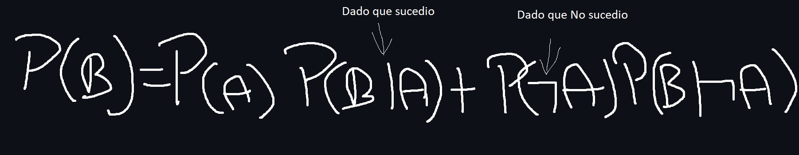

# intro-Programacion-Probabilistica

<p align="center">
  
</p>

La programación probabilística a día de hoy tiene muchos usos, investigación científica, medicina, etc

Una de las grandes diferencias que existen entre la programación probabilística, es que la programacion probabilistica utilizamos modelos probabilisticos

- [Modelos probabilisticos](#)
    - [Regresión lineal bayesiana](#)
    - [Redes Bayesianas](#)
    - [Teorema de Bayes](#)
    - [Modelos ocultos de Markov HMM](#)
    - [Procesos de Dirichlet](#)


Este tipo de programacion es tan importante que  existen lenguajes especificos para programas de este tipo de indole al igual que librerias

- [Lenguajes probabilisticos](#)
    - [Stan](#)
    - [Pyro](#)
    - [Church](#)
    - [Anglican](#)
    - [WeebPPL](#)

Uno de los mejores ejemplo que podemos usar para desarrolar nuestro pensamiento probabilistico es:

## Juan el Musico

Juan es un musico que le gusta desvelarse, el rock and rol, el heavy metal, y esta de parranda de lunes a sabado

Ahora, si te preguntaran hipoteticamente que es mas probable, ¿Que es mas probable que Juan sea un musico, o que sea musico y use drogas?

-----------------------------------------

La mayoria de las personas hubieran dicho que Juan es musico y ademas usa drogas.

Pero algo que tenemos que empezar a entender es que cuando utilizamos la palabra [Y](#) hace que la probabilidad de que eso cierto, siempre será menor


En este ejemplo tenemos visualmente mostrando en un circulo azul TODOS los musicos y en un circulo verde los musicos que usan drogas


Ahora en ese ejemplo se muestra las personas que ademas de ser musicos y usar drogas tambien juegan pokemon

Un punto muy importante a tener en cuenta es que cada vez que le agregagos una condicional a algo siempre resa menor o menos probable

# Clase 2

En esta clase hablaremos sobre la probabilidad condicional, Pero antes de continuar necesitamos entender un par de cosas

Calcular la probabilidad de un evento no es nada mas que la cantidad de veces que ocurre un evento dividido por la cantidad de enventos posibles


Esto nos sirve para un tipo de probabilidad muy especifica como la que hay en los jugos de azar o lanzar una moneda al aire, esta se llama [Probabilidad independiente](#)  osea que los eventos nos estan relacionados unos con los otros

Asi es es la formula de probailidad independienente de lazar una moneda y qe salgan dos cruzes


Lo malo es que no suelen llegar a ser muy utiles

Por eso utilizamos la [Probabilidad condicional](#)

Formula para resolver probabilidades condicionales es:



Con el ejemplo de Juan se puede demostrar como :


Esta formula se leeria como :

La probabilidad de que Juan use Drogas es igual a la probabilidad de que sea musico multiplicado por la probabilidad de use drogas dado que es musico mas la probabilida de que no sea musico multiplicado por la probabilidad que use drogas dado que no es musico

Esta tipo de prbabilidad es utilizada unicamente cuando un evento depende de otro evento

## Clase 3

### Teorema de bayes


El teorema de Bayes establece una relación entre las probabilidades condicionales P(A|B) y P(B|A), es decir, la probabilidad de que ocurra un evento A dado que ha ocurrido un evento B, y viceversa. La fórmula del teorema de Bayes es la siguiente:

#### _P(A|B) = (P(B|A) * P(A)) / P(B)_

Donde:

P(A|B) es la probabilidad de que ocurra el evento A dado que ha ocurrido el evento B.
P(B|A) es la probabilidad de que ocurra el evento B dado que ha ocurrido el evento A.
P(A) y P(B) son las probabilidades de que ocurran los eventos A y B, respectivamente.
El teorema de Bayes es especialmente útil cuando se trabaja con datos incompletos o evidencia parcial, y se utiliza ampliamente en diversos campos, como la inteligencia artificial, la estadística, la medicina, la economía y más. Es una herramienta fundamental para razonar sobre probabilidades y actualizar nuestras creencias a medida que obtenemos nueva información.

## Clase 4

Una vez entendido el Teorema de bayes llega el momento de entender y ponerle nombre a las secciones de nuestra formula

### _P(a)_

Prior: esta variable se pentiende como el conomiento previo que tenemos de ciertas situaciones o "Hipotesis" antes de recolectar evidencia

### _P(a|b)_

Posterior: esta variable la utilizamos despues de tener la evidencia de x como actualizamos nuestras creencias

### _P(b) = P(a) P(b|a) + P(¬a) P(b|¬a)_

Likelyhood: y esta formula la podemos entender como cual es la probabilidad de que esta probabilidad condicional se cumpla

--------------------------------------------

Tambien una manera mas facil de entender es tipo de formula un de una manera mas visual como un ecosograma

En este ecosograma podemos calcular la probabilidad de que un proyecto sea del estado, sabiendo que acabó fuera del plazo


##### Notas :

La probabilidad no necesariamente es matematica de la aleatoriedad sino la matematica de las proporciones

Es pensar cuantas veces yo espero ver algo dentro de la totalidad de lo que va suceder

## Clase 5 

### Análisis de síntomas


Tomando como base de apoyo los date que parecen el la imagen podemos hacer un calculo bastante preciso segun los datos de la imagen usando el teorema de bayes

```py

def calc_bayes(prior_A, prob_B_since_A, prob_B):

    #Representacion en codigo de a 
    #         P(a) P(b|a)
    #        -------------
    #             P(b)

    return(prior_A * prob_B_since_A)/ prob_B

if __name__ == '__main__':
    prob_cancer = 1 / 100000 # Probabilidad de realmente tener cancer
    prob_no_cancer = 1 - prob_cancer #Probabilidad de no tener cancer
    prob_symptoms_since_cancer = 1 #Probabilidad de tener sintomas debido a que tengo cancer
    prob_symptoms_since_no_cancer = 10 / 99999 #Probabilidad de tener un sintoma dado que no tengo cancer

    prob_symptoms = (prob_symptoms_since_cancer * prob_cancer) + (prob_symptoms_since_no_cancer * prob_no_cancer)

    prob_cancer_since_sintomas = calc_bayes(prob_cancer, prob_symptoms_since_cancer, prob_symptoms)

    print(f"There's a {round(prob_cancer_since_sintomas,4) * 100}% chance that you have cancer since a have symptoms")

    #P(a) = Tener cancer
    #P(b) = Tener sintomas de cancer

```

```bash
# Ejecutamos nuestro programa

# Y este sera nuestro resultado.
There's a 9.09% chance that you have cancer since a have symptoms
```

Tambien esto es una manera visual de mostrar lo:


## Clase 7

### Garbage in, garbage out (GIGO)

GIGO es un principio que informatico que hace referecia que si le das un input "Basura" a tu programa, algoritmo, etc de dará como output Basura

Para poder envitar errores de 3° nivel como GIGO devemos tomar en considerancion estos puntos

-   La calidad de nuestros datos en igual de        fundamental que la precisión de nuestro cómputos

-   Cuando los datos son errados, aunque tengamos un cómputo prístino nuestro resultados serán erróneos

-   En pocas palabras: con datos errados las conclusiones serán erradas

## Clase 8

### Imagenes engañosas

Infelizmente la probabilistica sí puede utizarse para mentir o para hacer que otras personas llegen a conclusiones que no son exactas, una de las maneras de egaño mas usadas son por medio de las imagenes 

como por ejemplo es este grafico de elecciones Venezolanas 


Ya ese ejemplo es un bastante exagerado pero da para entender 

Tambien existen otros ejemplo mas acercados a la realidad pero igualmente engañosos 


Esto engaño ocurre cuando se juega con las escalas porque puede hacer que algunas personas llegen a conclusiones incorrectas

#### Nota:

FIJA TE EN LAS ESCALAS

## Clase 9