# intro-Programacion-Probabilistica

<p align="center">
  
</p>

La programación probabilística a día de hoy tiene muchos usos, investigación científica, medicina, etc.

Una de las grandes diferencias que existen entre la programación probabilística, es que la programación probabilística utilizamos modelos probabilísticos

- [Modelos probabilisticos](#)
    - [Regresión lineal bayesiana](#)
    - [Redes Bayesianas](#)
    - [Teorema de Bayes](#)
    - [Modelos ocultos de Markov HMM](#)
    - [Procesos de Dirichlet](#)


Este tipo de programación es tan importante que existen lenguajes específicos para programas de este tipo de índole, al igual que librerías

- [Lenguajes probabilisticos](#)
    - [Stan](#)
    - [Pyro](#)
    - [Church](#)
    - [Anglican](#)
    - [WeebPPL](#)

Uno de los mejores ejemplos que podemos usar para desarrollar nuestro pensamiento probabilistico es:

### Juan el Músico

Juan es un músico que le gusta desvelarse, el rock and roll, el heavy metal, y está de parranda de lunes a sábado

Ahora, si te preguntaran hipotéticamente que es más probable, ¿Qué es más probable que Juan sea un músico, o que sea músico y use drogas?

-----------------------------------------

La mayoría de las personas hubieran dicho que Juan es músico y además usa drogas.

Pero algo que tenemos que empezar a entender es que cuando utilizamos la palabra [Y](#) hace que la probabilidad de que eso cierto, siempre será menor

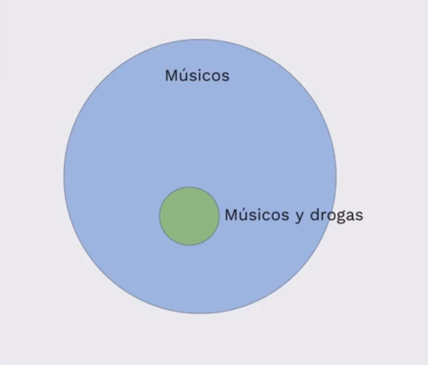

En este ejemplo tenemos visualmente mostrando en un círculo azul TODOS los músicos y en un círculo verde los músicos que usan drogas

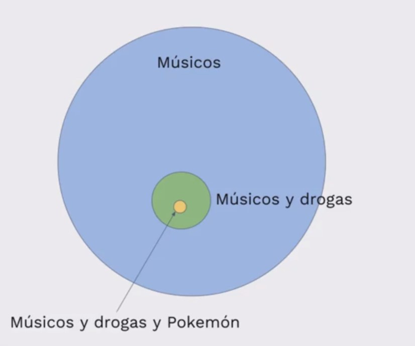

Ahora en ese ejemplo se muestra las personas que además de ser músicos y usar drogas, también juegan Pokémon

Un punto muy importante a tener en cuenta es que cada vez que le agregamos una condicional a algo siempre será menor o menos probable

## Clase 2

En esta clase hablaremos sobre la probabilidad condicional, Pero antes de continuar necesitamos entender un par de cosas

Calcular la probabilidad de un evento no es nada más que la cantidad de veces que ocurre un evento dividido por la cantidad de eventos posibles

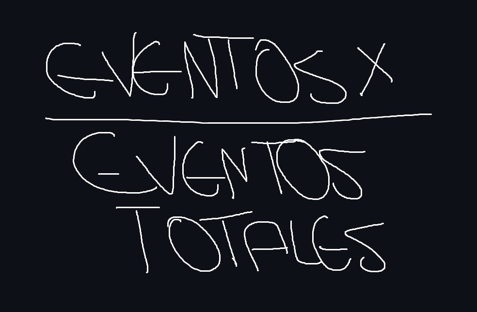


Esto nos sirve para un tipo de probabilidad muy específica como la que hay en los jugos de azar o lanzar una moneda al aire, esta se llama [Probabilidad independiente,](#)  o sea que los eventos nos están relacionados los unos con los otros

Así es la fórmula de probabilidad independiente de lazar una moneda y que salgan dos cruces

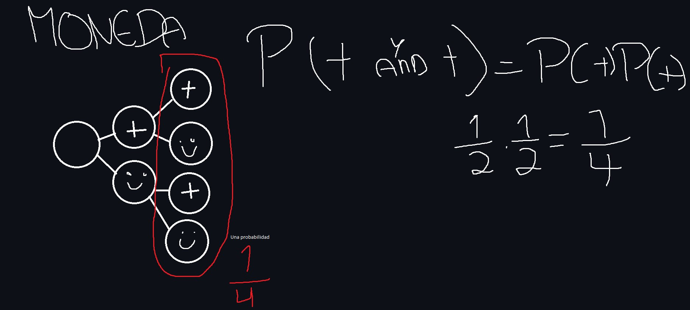


Lo malo es que no suelen llegar a ser muy útiles

Por eso utilizamos la [Probabilidad condicional](#)

Fórmula para resolver probabilidades condicionales es:

### _P(b) = P(a) P(b|a) + P(¬a) P(b|¬a)_

Con el ejemplo de Juan se puede demostrar como:

### _P(Drogas) = P(Musico) P(Drogas|Musico) + P(¬Musico) P(Drogas|¬Musico)_

###### "|" se lee como dado que  
###### "¬" se lee no o negación

Esta fórmula se leería como:

La probabilidad de que Juan use Drogas es igual a la probabilidad de que sea músico multiplicado por la probabilidad de que use drogas, dado que es músico más la probabilidad de que no sea músico multiplicado por la probabilidad que use drogas, dado que no es músico

Este tipo de probabilidad es utilizada únicamente cuando un evento depende de otro evento

## Clase 3

### Teorema de bayes

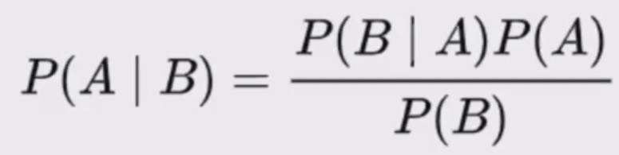

El teorema de Bayes establece una relación entre las probabilidades condicionales P(A|B) y P(B|A), es decir, la probabilidad de que ocurra un evento A dado que ha ocurrido un evento B, y viceversa. La fórmula del teorema de Bayes es la siguiente:

#### _P(A|B) = (P(B|A) * P(A)) / P(B)_

Donde:

P(A|B) es la probabilidad de que ocurra el evento A dado que ha ocurrido el evento B.
P(B|A) es la probabilidad de que ocurra el evento B dado que ha ocurrido el evento A.
P(A) y P(B) son las probabilidades de que ocurran los eventos A y B, respectivamente.
El teorema de Bayes es especialmente útil cuando se trabaja con datos incompletos o evidencia parcial, y se utiliza ampliamente en diversos campos, como la inteligencia artificial, la estadística, la medicina, la economía y más. Es una herramienta fundamental para razonar sobre probabilidades y actualizar nuestras creencias a medida que obtenemos nueva información.

## Clase 4

Una vez entendido el Teorema de Bayes llega el momento de entender y ponerle nombre a las secciones de nuestra fórmula

### _P(a)_

Prior: esta variable se entiende como el conocimiento previo que tenemos de ciertas situaciones o "Hipótesis" antes de recolectar evidencia

### _P(a|b)_

Posterior: esta variable la utilizamos después de tener la evidencia de x como actualizamos nuestras creencias

### _P(b) = P(a) P(b|a) + P(¬a) P(b|¬a)_

Likelyhood: y esta fórmula la podemos entender como cuál es la probabilidad de que esta probabilidad condicional se cumpla

--------------------------------------------

Una manera más fácil de entender este tipo de fórmula es a través de una representación visual, usando a un ecosograma

En este ecosograma podemos calcular la probabilidad de que un proyecto sea del estado, sabiendo que acabó fuera del plazo

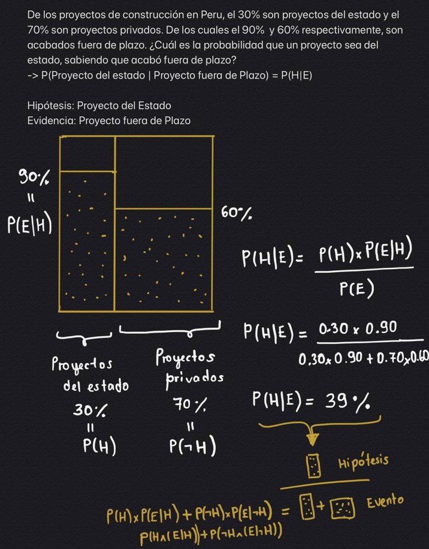

##### Notas:

La probabilidad no necesariamente es matemática de la aleatoriedad, sino la matemática de las proporciones

Es pensar cuantas veces yo espero ver algo dentro de la totalidad de lo que va a suceder

## Clase 5 

### Análisis de síntomas

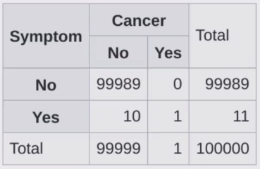

Tomando como base de apoyo los datos que parecen en la imagen podemos hacer un cálculo bastante preciso según los datos de la imagen usando el teorema de Bayes

```py

def calc_bayes(prior_A, prob_B_since_A, prob_B):

    #Representacion en codigo de a 
    #         P(a) P(b|a)
    #        -------------
    #             P(b)

    return(prior_A * prob_B_since_A)/ prob_B

if __name__ == '__main__':
    prob_cancer = 1 / 100000 # Probabilidad de realmente tener cancer
    prob_no_cancer = 1 - prob_cancer #Probabilidad de no tener cancer
    prob_symptoms_since_cancer = 1 #Probabilidad de tener sintomas debido a que tengo cancer
    prob_symptoms_since_no_cancer = 10 / 99999 #Probabilidad de tener un sintoma dado que no tengo cancer

    prob_symptoms = (prob_symptoms_since_cancer * prob_cancer) + (prob_symptoms_since_no_cancer * prob_no_cancer)

    prob_cancer_since_sintomas = calc_bayes(prob_cancer, prob_symptoms_since_cancer, prob_symptoms)

    print(f"There's a {round(prob_cancer_since_sintomas,4) * 100}% chance that you have cancer since a have symptoms")

    #P(a) = Tener cancer
    #P(b) = Tener sintomas de cancer

```

```bash
# Ejecutamos nuestro programa

# Y este sera nuestro resultado.
There's a 9.09% chance that you have cancer since a have symptoms
```

También esto es una manera visual de mostrar lo:
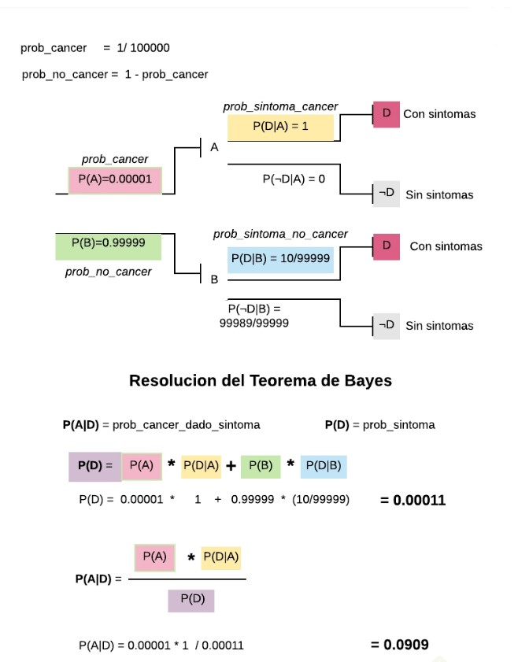

## Clase 7

### Garbage in, garbage out (GIGO)

GIGO es un principio que informático que hace referencia que si le das un input "Basura" a tu programa, algoritmo, etc. se dará como output Basura

Para poder evitar errores de 3° nivel como GIGO debemos tomar en consideración estos puntos

-   La calidad de nuestros datos en igual de fundamental que la precisión de nuestro cómputo

-   Cuando los datos son errados, aunque tengamos un cómputo prístino, nuestros resultados serán erróneos

-   En pocas palabras: con datos errados las conclusiones serán erradas

## Clase 8

### Imagenes engañosas

Infelizmente, la probabilística sí puede utilizarse para mentir o para hacer que otras personas lleguen a conclusiones que no son exactas, una de las maneras de engaño más usadas son por medio de las imágenes 

como por ejemplo es este gráfico de elecciones Venezolanas 

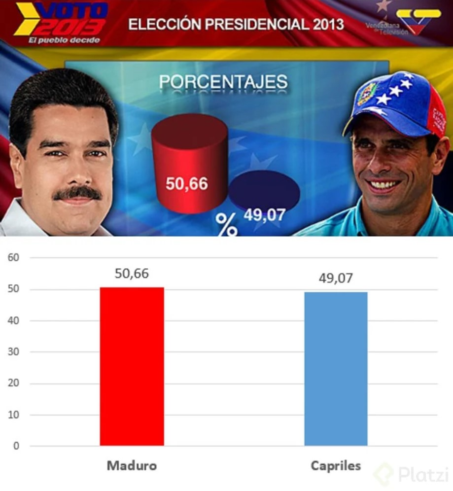

Ya ese ejemplo es un bastante exagerado pero da para entender 

También existen otros ejemplos más acercados a la realidad pero igualmente engañosos 


Este engaño ocurre cuando se juega con las escalas porque puede hacer que algunas personas lleguen a conclusiones incorrectas

#### Nota:

FIJATE EN LAS ESCALAS

## Clase 9

### Cum Hoc Ergo Propter Hoc

Del latín **"con esto, por lo tanto, a causa de esto"**
hace referencia a la falacia de correlación causalidad

Esta falacia se comete cuando se asume erróneamente que debido a que dos eventos ocurren juntos o se correlacionan, uno debe ser la causa del otro. Es un error lógico confundir la correlación con la causalidad.

Como por ejemplo, supongamos que una persona tiene un **amuleto de la suerte** y a lo largo de un mes vive una serie de eventos en su vida como; conseguir un **ascenso en el trabajo, ganar la lotería y encontrar el amor**.

La persona podría pensar erróneamente de todo eso ocurrió gracias al amuleto de la suerte y llegar a la conclusión que el **amuleto da buena fortuna**

Pero en realidad, es probable que haya otros factores involucrados en estos hechos, como **el esfuerzo, la habilidad, el azar o circunstancias favorables**

## Clase 10

### Prejuicio en el muestreo

También conocido como sesgo de muestreo, puede distorsionar los resultados y conducir a conclusiones incorrectas o poco representativas.

Imagina que se está realizando una encuesta política en un x país, las personas responsables de la encuesta hacen la encuesta únicamente en una zona urbana muy poblada, sin tomar en cuenta las poblaciones más rurales, como resultado la muestra será sesgada y tendrá una representación pobre tomando en consideración la población total

## Clase 11

### La falacia del francotirador

La falacia del francotirador es un error lógico que implica la sobreinterpretación de patrones aleatorios, se basa en una situación hipotética en la que un francotirador dispara totalmente aleatorio a una pared de la granja cuando se le acaban las balas va y pinta una diana donde hay un mayor cúmulo de huecos de disparos

Este es un ejemplo, pero también podemos tomar otro por ejemplo como este:

Imagina que alguien está buscando evidencia de poderes psíquicos y decide llevar a cabo una prueba. Invita a varias personas a participar en un experimento en el que deben intentar adivinar qué carta está boca abajo de un mazo. Después de varias rondas de intentos, una de las personas logra adivinar correctamente varias veces seguidas.

El investigador, al observar estos resultados aparentemente impresionantes, concluye que esta persona tiene habilidades psíquicas y puede predecir el futuro

En resumen, esta falacia intenta busca una relación entre dos o más datos para buscar una correlación inexistente entre los mismos y disfrazar la información para generar conclusiones en el público erradas

## Clase 12

### Porcentajes confusos

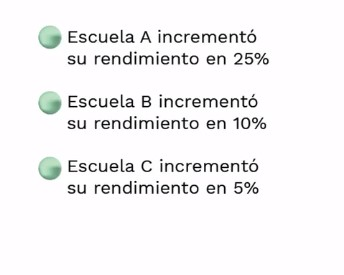

Tomando en consideración el porcentaje de rendimiento de cada una de las escuelas, ¿cuál dirías que él la mejor escuela?

La verdad tomar conclusiones con solo esos datos es bátante difícil tomar una decisión certera por la falta de datos

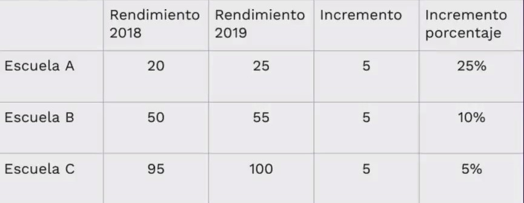

Si ahora nos percatamos los porcentajes estaban ciertos, pero con solo los porcentajes no se mostraba que en realidad cada escuela se había subido 5 puntos incremento, ni tampoco que cada escuela si promedio es muy diferentes entre sí

Conclusiones, no te dejes llevar por los porcentajes tan fácilmente, de escéptico

## Clase 13

### Falacia de regresión

-   Muchos eventos fluctúan naturalmente, por ejemplo, la temperatura promedio de una ciudad, el rendimiento de un atleta, los rendimientos de un portafolio de inversión, etc.

-   Cuando algo fluctúa y se aplican medidas correctivas, se puede creer que existe un vínculo de causalidad en lugar de una regresión a la media.

Supongamos que un estudiante universitario está estudiando para un examen final. Durante el semestre, el estudiante ha estado obteniendo calificaciones bastante bajas en los exámenes parciales, pero después de mucho esfuerzo, logra obtener una calificación muy alta en el último examen.

El estudiante, al ver su alta calificación, llega a la conclusión de que su nuevo método de estudio fue extremadamente efectivo y que seguramente le ayudará a obtener altas calificaciones en el futuro. Sin embargo, esta conclusión podría ser una falacia de regresión.

La falacia de regresión ocurre cuando se asume erróneamente que un evento extremo o inusual en una serie de datos es indicativo de un cambio permanente o significativo en esa serie. En este caso, la alta calificación en el último examen podría haber sido simplemente una anomalía o un golpe de suerte.

Una cosa a tomar en cuenta es que estos no son los únicos errores de pensamiento probabilístico, pero si son unos de lo más comunes, pero para enriquecer un poco estas notas aquí dejo unas cuantas más:

-   Falacia del jugador: Es el error de creer que los resultados de eventos aleatorios están influenciados por eventos previos. Por ejemplo, creer que después de lanzar una moneda y obtener cara varias veces seguidas, la probabilidad de obtener cruz en el próximo lanzamiento es más alta. En realidad, cada lanzamiento es independiente y la probabilidad sigue siendo del 50% en cada lanzamiento.

-   Sesgo de disponibilidad: Ocurre cuando se estima la probabilidad de un evento basándose en la facilidad con la que se pueden recordar ejemplos o información relacionada. Por ejemplo, si se escuchan noticias sobre un aumento en los casos de robo, es posible que se sobreestime la probabilidad de ser víctima de un robo, aunque los robos sean eventos relativamente raros en general.

-   Ilusión de agrupamiento: Es el error de creer que los eventos aleatorios se distribuyen uniformemente en el tiempo. Por ejemplo, si en un casino se observan ráfagas de victorias en la ruleta, es posible que se crea que hay algún patrón o sistema detrás de ellas, cuando en realidad es simplemente una fluctuación normal en los resultados aleatorios.

-   Efecto del tamaño de la muestra: Es el error de ignorar el tamaño de la muestra al considerar las probabilidades. Si se toma una muestra pequeña, es más probable que los resultados sean menos representativos de la población en general. Es importante tener en cuenta el tamaño de la muestra al interpretar resultados y no sacar conclusiones basadas en muestras pequeñas.

## Clase 14

### Introducción Machine Learning

En palabras de Arthur Samuel, en 1959  el machine learning es "Es el campo de estudio que le da a las computadoras la habilidad de aprender sin ser explícitamente programadas"

En otras palabras, machine learning, nosotros le damos datos, la computadora genera las funciones necesarias para convertir estos datos y nos va a dar un output como si nosotros hubiéramos programado la computadora directamente


## Clase 15

### Feature vectors

Los vectores de características son representaciones numéricas de atributos utilizadas en el aprendizaje automático. Codifican información relevante sobre los datos, como color, forma o textura. Permiten a los algoritmos analizar y comparar muestras de manera eficiente para tareas como clasificación y agrupamiento. Son fundamentales para entrenar modelos, extraer patrones y hacer predicciones precisas.

##### Nota:
Es ciertamente similar a POO :)

En mi opinión, si quisiera modelar un vector que identifique árboles, tendría que tomar las características que puede cambiar dentro de un árbol que son:

-Tamaño /Forma /Color de las hojas
-Tamaño /Forma /Color de las ramas
-Tamaño /Forma /Color del tronco
-Sí da frutos

Dentones con estos datos ya nos podríamos hacer a la idea de qué árbol estamos tratando o por lo menos hacer una hipótesis de qué árbol es más certera

Poniendo como ejemplo diferenciador un árbol manzano y un árbol de cerezo o también conocido como sakura podemos diferenciar cada uno con los datos anteriormente mencionados

Manzano:

-   Hojas: Las hojas del manzano suelen ser ovaladas o lanceoladas, con bordes dentados. Son de color verde brillante durante la primavera y el verano, y pueden adquirir tonos de color amarillo, rojo o naranja en otoño antes de caer.

-   Flores: Las flores del manzano son generalmente de color blanco o rosa claro, y se agrupan en racimos. Cada flor tiene cinco pétalos, y suelen florecer en primavera.

-   Frutas: El manzano produce manzanas de diferentes tamaños, formas y colores, dependiendo de la variedad. Las manzanas pueden ser de color verde, amarillo, rojo o una combinación de estos, y varían en sabor y textura.


Árbol de cerezo (sakura):

-   Hojas: Las hojas del cerezo son generalmente ovaladas o en forma de punta de lanza. Son de color verde brillante durante la primavera y el verano, y adquieren tonos de amarillo o rojo antes de caer en otoño.

-   Flores: Las flores del cerezo, conocidas como sakura, son uno de los aspectos más destacados de este árbol. Son de color rosa claro o blanco, y tienen cinco pétalos. Las flores de sakura suelen florecer en primavera y crean una vista espectacular en forma de racimos o nubes de flores.

-   Frutas: A diferencia del manzano, el cerezo no produce frutas comestibles de manera generalizada. Algunas variedades de cerezo pueden desarrollar pequeñas y ácidas frutas llamadas “cerezas de pájaro”, pero no se cultivan para consumo humano.

## Clase 16

### Métricas de distancia

Las métricas de distancia de distancia nos permiten tener una forma de quantifiquar que tan cercanos o lejanos estan los vectores que nosotros estamos incorporando directamente al algoritmo

Algunos ejemplos de métricas de distancia son:

-   **Distancia euclidiana:** Es la distancia directa entre dos puntos, como medir la longitud de una línea recta que los une.
-   **Distancia Manhattan:** Mide la distancia moviéndose solo en línea recta horizontal y vertical, sin diagonales. Es como calcular cuántas cuadras hay de un punto a otro en una ciudad.
-   **Distancia de Hamming:** Se utiliza cuando se comparan secuencias de elementos, contando cuántos elementos son diferentes.
-   **Distancia de Jaccard:** Mide la similitud entre conjuntos, calculando la proporción entre los elementos comunes y los totales.

## Clase 17

Una de las formas mas comunes de clasificar los algoritmos de ML es en algoritmos de agrupamientos o **Clustering** y algoritmos de clasificacion o **Classificacion**

#### Clustering

Los algoritmos de clustering nos ayuda enterder la estructura de los datos cuando no tenemos o no necesitamos etiquetas para lo mismo

Tambien nos permiten agrupar cada uno de nuestros datos en diferentes grupos que lo que llamamos **Clusters**

Estos nos permiten entender que tan lejanos o cercanos (similares o desimilares) son los diferentes Data Points que analizamos 

Los cluster son muy utlizados en el mundo de las redes sociales para cosas como los likes, temas de interes, quien es amigo de quien, en general mucha informacion valiosa cuando podemos clasificar a cada unos de los **Clusters** que viven dentro de nuestros datos

<p align="center">
  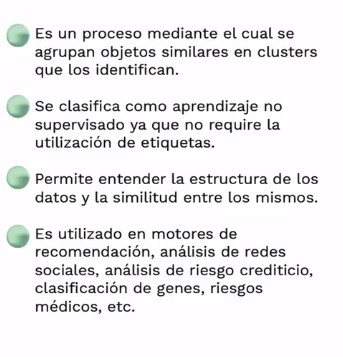
</p>

## Clase 18

### Agrupamiento jerarquico

El agrupamiento jerarquico es un algortimo lo que hace es tomar los puntos mas cercanos y agruparlos en un grupo que le llamaremos **Cluster** y luego comporar la distancia entre este **Cluster** y el punto mas cercano, agruparlo y repetir este proceso iterativamente

<p align="center">
  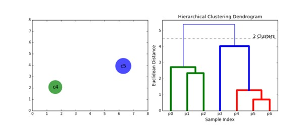
</p>


